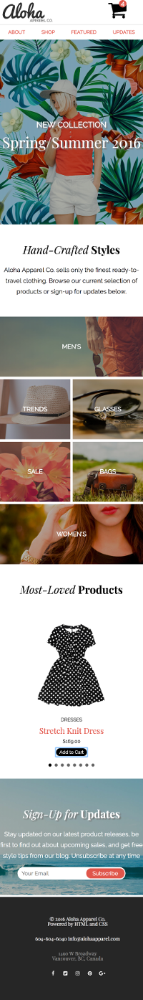
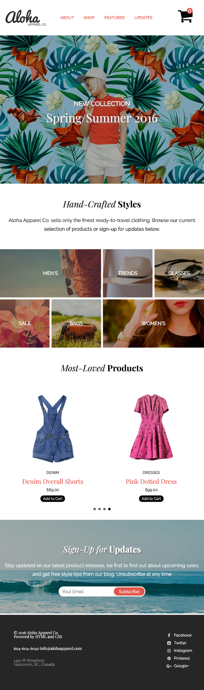
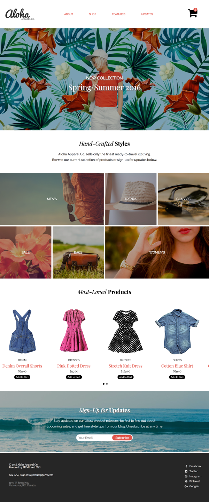

<h1> Aloha Shopping </h1>

 Simple landing page built using HTML, SCSS, JAVASCRIPT and JQUERY.
 
 

 Mobile first approach was used for styling. Media queries were added for tablet and desktop widths to make page responsive

 

BXSlider plugin was used to slide through items. (https://bxslider.com/) 

 Additional function was added to count items total items in shopping cart 

 

<h1>MOBILE</h1>

<h1>TABLET</h1>

<h1>DESKTOP</h1>

